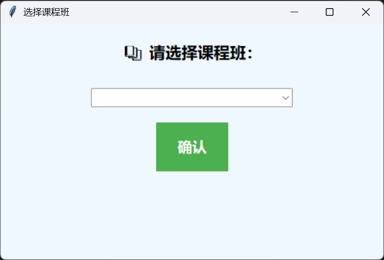
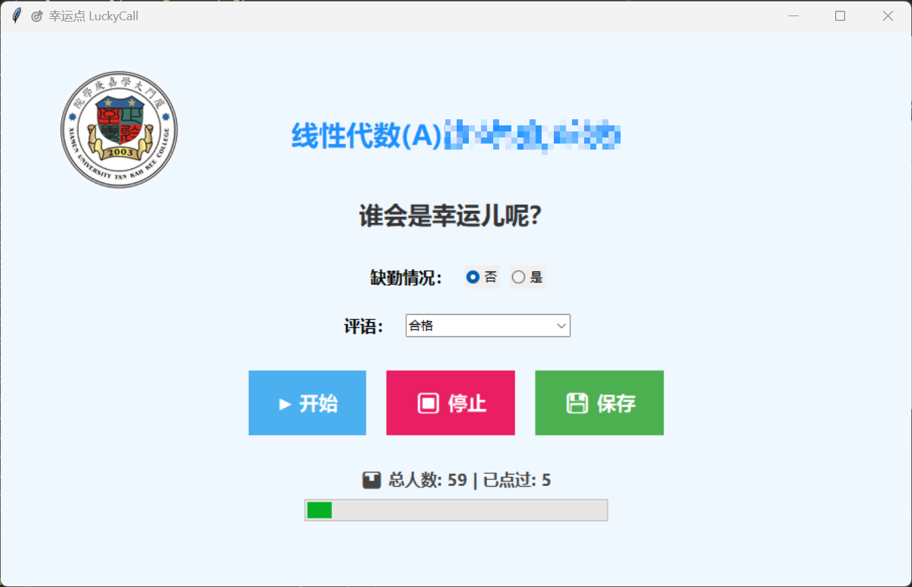
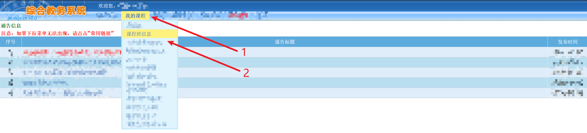
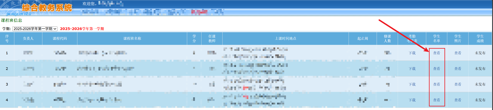

# 幸运点 LuckyCall

> **中文名称**：幸运点  
> **英文名称**：LuckyCall  
> 设计初衷：教师与学生的互动环节是教学中必不可少的。本工具旨在使用数字化的工具，随机选择学生与之互动，并增加趣味性，增加学生的学习兴趣。  
> 设计理念：无论被点名的学生是否会回答问题，该学生都是有收获的，是幸运的。  
- 会回答：可以产生一种自豪感，对学习更有兴趣
- 不会回答：在老师解答时，对问题的印象更深刻

> **项目地址：** https://github.com/MatNoble/LuckyCall/tree/TKK  
> 注：该分支用于厦门大学嘉庚学院

## 功能简介

1. 选择课程班界面



2. 随机点名界面



- 依次点击，`开始` --> `停止` 进行点名
- 若学生缺勤，则选择 `缺勤情况` : `是`，然后点击 `保存`
- 根据学生的回答情况，选择 `评语` 后，点击 `保存`

## 使用说明
1. 下载压缩包，并解压，保证目录结构如下：
```bash
  ├── classes
  ├── icon
  |   ├── lucky_call.ico
  │   └── sschool_logo.png
  └── LuckyCall.exe
```
2. 进入 `综合教务系统`，依次点击 `我的课程` --> `课程班信息`



3. 选择一个课程班，点击 `学生名单` 中的 `查看`



4. 点击 `导出名单`


5. **重要：** 对于导出的 csv 格式的名单重命名为 `students.csv`

6. **重要：** 以课程名名称（如：班级一）创建文件夹，并将第 5 步骤中的 `students.csv` 放到该文件夹中
```bash
  ├── 班级一
  │   └── students.csv
```

7. 将第 6 步骤，创建的文件夹移动到 `Luck Call` 项目目录中的 `classes` 中，即可运行 `LuckyCall.exe`

```bash
  ├── classes
  │   ├── 班级一
  │   │   └── students.csv
  ├── icon
  |   ├── lucky_call.ico
  │   └── sschool_logo.png
  └── LuckyCall.exe
```

8. 同时，支持在 `classes` 下放置不同的班级列表，结构如下

```bash
  ├── classes
  │   ├── 班级一
  │   │   └── students.csv
  │   └── 班级二
  │       └── students.csv
  ├── icon
  |   ├── lucky_call.ico
  │   └── sschool_logo.png
  └── LuckyCall.exe
```

## 课后回溯
在每个课程班文件夹下，会自动生成 `records.csv` 来记录同学课堂表现情况
  ```bash
  ├── classes
  │   ├── 班级一
  │   │   ├── records.csv
  │   │   └── students.csv
  │   └── 班级二
  │       ├── records.csv
  │       └── students.csv
  ├── LuckyCall
  └── LuckyCall.exe
  ```

  其中，`LuckyCall` 和 `LuckyCall.exe` 分别为 Linux 和 Windows 的可执行文件，在同级目录下放至 `classes` 文件夹，下层放至以课程班名称为名的目录，每个课程班目录下需要 `students.csv`，需要至少包含 `学号` 和 `姓名` 两列。

## 功能说明
### 已完成功能:   
1. 选择课程班
2. 随机点名功能
3. 记录问题回答情况
4. 不需要额外的 Python 环境，支持可执行文件
5. 教务系统名单自动化转化

### 待完善功能：
1. 屏蔽选择课程班的功能
2. 自动生成考勤表
3. 分组功能

## 开发指南

### 调试
```sh
# Windows
python lucky_call.py

# Linux
python3 lucky_call.py
```

### 打包命令
```sh
# Windows
pyinstaller --onefile --windowed --icon=icon\\lucky_call.ico lucky_call.py

# Linux
pyinstaller --onefile --windowed --icon=icon/lucky_call.ico lucky_call.py
```
